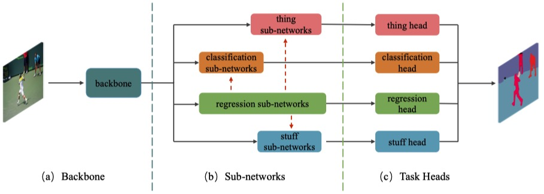

# SpatialFlow: Bridging all Task for Panoptic Segmentation

> [**SpatialFlow: Bridging all Task for Panoptic Segmentation**](https://arxiv.org/abs/1910.08787v3),
> 
> Qiang Chen, Anda Cheng, Xiangyu He, Peisong Wang, Jian Cheng
> 
> In IEEE Transactions on Circuits and Systems for Video Technology,
>
> *arXiv preprint ([arXiv 1910.08787](https://arxiv.org/abs/1910.08787v3))*

## Installation
- We adopt the codebase **mmdetection** with hash code 
[9596b9a](https://github.com/open-mmlab/mmdetection/tree/9596b9a4c916ae601f9a8a641c3a0ea47265abec).
- Please follow the [guide](docs/install.md) to install **mmdet**.
- To prepare the dataset, please follow the [guidance](tools/panoptic_converters/README.md) of dataset converters.

## Modification for `MMCV`
- Comment out  the line `kwargs.setdefault('default', set_default)` in the 
function `dump_to_fileobj` in [mmcv](https://github.com/open-mmlab/mmcv/blob/master/mmcv/fileio/handlers/json_handler.py) to use `MyJsonEncoder` instead for `mmcv
.dump`.
- Add a registry for `ModulatedDeformConv2d` in [this line](https://github.com/open-mmlab/mmcv/blob/master/mmcv/ops/modulated_deform_conv.py#L147) as follow
```python
@CONV_LAYERS.register_module('ModulatedDeformConv')
class ModulatedDeformConv2d(nn.Module):
    ...
```
- Add support for `ModulatedDeformConv2d` in `ConvModule` [here](https://github.com/open-mmlab/mmcv/blob/master/mmcv/cnn/bricks/conv_module.py#L180)
```python
def forward(self, x, offset=None, mask=None, activate=True, norm=True):
        for layer in self.order:
            if layer == 'conv':
                if self.with_explicit_padding:
                    x = self.padding_layer(x)
                if offset is not None:
                    if mask is not None:
                        x = self.conv(x, offset, mask)
                    else:
                        x = self.conv(x, offset)
                else:
                    x = self.conv(x)
```

## Main results

### Panoptic Segmentation on COCO validation

#### **SpatialFlow-res50** ([download](https://1drv.ms/u/s!AgM0VtBH3kV9ilUOYM2Hd7EQseB1?e=jQeiu5))
|  | PQ | SQ | RQ | N |
| ------ |------ | ------ | ------ | ------ |
| All | 41.8 | 78.7 | 50.9 | 133 |
| Things | 48.3 | 82.0 | 58.0 | 80 |
| Stuff | 31.9 | 73.7 | 40.2 | 53 |

#### **SpatialFlow-res101** ([download](https://1drv.ms/u/s!AgM0VtBH3kV9ilUOYM2Hd7EQseB1?e=jQeiu5))
|  | PQ | SQ | RQ | N |
| ------ |------ | ------ | ------ | ------ |
| All | 43.4 | 79.6 | 52.6 | 133 |
| Things | 50.4 | 82.4 | 60.3 | 80 |
| Stuff | 32.8 | 75.4 | 41.0 | 53 |

#### **SpatialFlow-res101-DCN-MultiScale** ([download](https://1drv.ms/u/s!AgM0VtBH3kV9ilUOYM2Hd7EQseB1?e=jQeiu5))
|  | PQ | SQ | RQ | N |
| ------ |------ | ------ | ------ | ------ |
| All | **48.0** | 81.3 | 57.5 | 133 |
| Things | **55.0** | 82.5 | 65.2 | 80 |
| Stuff | **37.6** | 79.5 | 46.0 | 53 |

### Panoptic Segmentation on COCO test-dev

#### **SpatialFlow-res101-DCN-MultiScale** ([download](https://1drv.ms/u/s!AgM0VtBH3kV9ilUOYM2Hd7EQseB1?e=jQeiu5))([test_dev_results](https://1drv.ms/u/s!AgM0VtBH3kV9ilUOYM2Hd7EQseB1?e=jQeiu5))
|  | PQ | SQ | RQ | N |
| ------ |------ | ------ | ------ | ------ |
| All | **48.5** | 81.8 | 58.1 | 133 |
| Things | **55.5** | 83.3 | 65.9 | 80 |
| Stuff | **37.9** | 79.5 | 46.4 | 53 |

*Disclaimer:*

- This is a reimplementation using `mmdetv2` and the PQ is slightly
 higher than the one of our original paper (~0.9% PQ).
- We use `fp16 training` for `res101-DCN-Multiscale`.
- All the results listed here are measured on COCO val split. According to 
our experimental results, the performance on COCO test-dev will be slightly 
higher than the one on COCO val (~0.5% PQ).

## Usage

- The `learning_rate` in configs is setting default for 4 GPUs.

### Train with multiple GPUs
```shell
./tools/dist_train.sh ${CONFIG_FILE} ${GPU_NUM}

# Example: 
# ./tools/dist_train.sh configs/spatialflow/spatialflow_r50_fpn_20e_coco.py 4
```

### Testing
```shell
# multi-gpu testing
./tools/dist_test.sh ${CONFIG_FILE} ${CHECKPOINT_FILE} ${GPU_NUM} --out ${OUTPUT_FILE} --eval panoptic
    
Example: 
./tools/dist_test.sh configs/spatialflow/spatialflow_r50_fpn_20e_coco.py 
./work_dir/spatialflow_r50_fpn_20e_coco/latest.pth  8  --out ./work_dir/spatialflow_r50_fpn_20e_coco/results.pkl --eval panoptic

# single-gpu testing
python tools/test.py ${CONFIG_FILE} ${CHECKPOINT_FILE} --out ${OUTPUT_FILE} --eval panoptic
    
Example: 
python tools/test.py configs/spatialflow/spatialflow_r50_fpn_20e_coco.py  ./work_dir/spatialflow_r50_fpn_20e_coco/latest.pth 
--out ./work_dir/spatialflow_r50_fpn_20e_coco/results.pkl --eval panootic
```

## Citation
Please consider citing our papers in your publications if the project helps your research. BibTeX reference is as follows.

```
@artical{chen2020spatialflow,
  author={Chen, Qiang and Cheng, Anda and He, Xiangyu and Wang, Peisong and 
  Cheng, Jian},
  journal={IEEE Transactions on Circuits and Systems for Video Technology}, 
  title={SpatialFlow: Bridging all Task for Panoptic Segmentation}, 
  year={2020}
  doi={10.1109/TCSVT.2020.3020257}}
```
